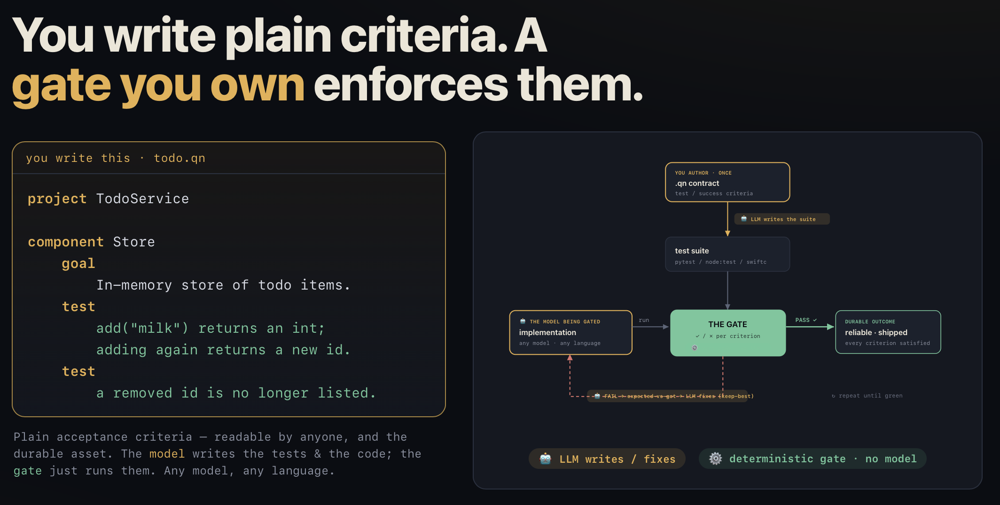

# Quinny

**An executable specification language.**



Created by **[LingCode Baby](https://lingcode.dev/baby.html)** — a macOS IDE
that embeds Quinny as its built-in verify loop.

Describe *what* your software must do — its components and their concrete
acceptance criteria — in a small, reviewable `.qn` file. Quinny turns those
criteria into a runnable test suite and **verifies any implementation against
them** — code written by a human or by any AI coding assistant, in Python,
JavaScript, TypeScript, Go, or Swift. Write the contract once; enforce it forever, in any language, in CI.

```
spec.qn ──► quinny verify ──► ✓/✗ per acceptance criterion, on ANY code, ANY language
   │                │
   │ reviewable     │ compiles your `test` criteria into a real test suite
   │ contract       │ (pytest / node:test), runs it, gates the build
```

A `.qn` file is **not code that runs** — it's a structured, version-controllable
statement of intent *and* the contract that decides whether an implementation
satisfies it.

## How it fits your dev cycle

Modern agents (Claude Code, Cursor) already write code well — fast, one-shot.
Quinny doesn't compete with that; it **holds the output to a contract you own.**

**Don't want to write the contract?** You don't have to. `quinny scaffold "build me
a store for selling trees"` scopes the part where correctness matters (the pricing,
cart, and inventory *logic* — not the UI, which `verify` can't gate anyway), drafts
the acceptance criteria, and stubs the module. You go straight to implement → verify.

```
write spec.qn  ──►  let any agent write/change the code  ──►  quinny verify  ──►  ✓ / ✗
   (once)              (its strength — fast, one-shot)          (your gate)
```

| Instead of… | With Quinny |
|---|---|
| Re-reading the diff to check requirements still hold | `quinny verify` checks them, per criterion |
| Hand-writing acceptance tests (the `mini_kv` contract → 147 lines) | generated from the spec you already wrote |
| Re-prompting an LLM to "review this against the spec" every change | emit the suite **once**, run it free forever |
| Re-specifying for each tool or model you try | one `.qn` gates them all, unchanged |

**In real terms** (all measured, not estimated):

- **~12 seconds** and **under a penny** to turn a spec into a ~140-line acceptance
  suite — the same suite you'd otherwise hand-write in ~30 minutes.
- **0.24 seconds** and **$0** to check *any* implementation against that committed
  suite — no AI in the loop, every time, forever.

**Say you try 10 implementations** before one sticks (you plus a couple of agents,
iterating). Generate the contract *once* (~12 s, <1¢), then verify all ten — about
**2.4 seconds total, $0**. Without it, you'd hand-write the tests once, or re-read
all ten diffs against the spec yourself. And it keeps paying off: every later
commit, refactor, or model swap is re-checked in a quarter-second, catching a broken
requirement before it ships. Your AI cost scales with **spec changes, not commits** —
50 pushes between spec edits still cost one ~12-second generation.

---

## Install

```bash
# One-liner — installs the Python-free binary on Apple Silicon, else falls back to pip:
curl -fsSL https://raw.githubusercontent.com/Xavierhuang/quinny/main/install.sh | sh

# Or straight from PyPI (needs Python 3.10+):
pip install quinny
```

The installer honors `QUINNY_METHOD=pip|binary`, `QUINNY_VERSION=vX.Y.Z`, and
`QUINNY_PREFIX=<dir>`. Prebuilt binaries are attached to each
[GitHub Release](https://github.com/Xavierhuang/quinny/releases). From source:
`git clone … && cd quinny && pip install -e .`. Requires Python 3.10+.

## Quickstart: verify an implementation against intent

Write `todo.qn` — note the concrete `test` lines, they're the contract:

```
project TodoService

component Store
    goal
        In-memory store mapping ids to todo items.

task AddTodo
    goal
        Add a todo item and return its integer id; ids never repeat.
    uses
        Store
    test
        add("milk") returns an int; adding again returns a different id.
    test
        A removed id is no longer listed.
```

Validate the spec itself (no LLM, no key needed):

```bash
quinny check todo.qn      # ✓ parses + graph is valid (missing deps, cycles)
```

Then verify any implementation directory against the contract:

```bash
quinny verify todo.qn ./my_impl/           # compiles `test` criteria, runs them
quinny verify todo.qn ./my_impl/ --emit contract_test.py   # save the suite…
quinny verify todo.qn ./my_impl/ --suite contract_test.py  # …then re-run it, no LLM
```

Output is a per-criterion PASS/FAIL table and a gate exit code. The
**emit → review → `--suite`** flow locks the generated suite into a committed file
so CI runs it deterministically, with no model in the loop — see
**[docs/ci.md](docs/ci.md)** for the ready-to-copy GitHub Action.

### How reliable is the gate?

**In plain terms: across ~85 implementations — some correct, some deliberately
broken, some shaped like real CVEs — verify flagged every broken one and never
once passed a bad one.** The few times it disagreed with a human-written suite,
it was being *stricter*, not letting a bug through. The measured detail, five
benchmarks in [`benchmarks/`](benchmarks/):

**Synthetic** — implementations with known, exact defects (`verify_usability.py`):

| Metric | Result |
|---|---|
| False-PASS (green-lights a real defect) | **0 / 60** |
| False-FAIL (fails correct code) | **0 / 60** |
| Accuracy vs ground truth | **100%** |
| Consistency across runs | **100%** |

**Real-world** — 13 model-generated implementations across three domains (a data
structure, a formula engine, a 9-module interpreter), verify's gate vs an
*independent* hand-written held-out suite (`verify_realworld.py`):

| Metric | Result |
|---|---|
| Agreement with held-out ground truth | **12 / 13 = 92%** |
| Mean gate score on **good** impls | **89%** |
| Mean gate score on **broken** impls | **0%** |
| False-PASS (green-lit broken code) | **0 / 13** |

**Determinism** (`verify_determinism.py`) — emit a suite once, then re-run it via
`--suite`: **60 re-runs, zero verdict drift** (correct impl 6/6 every run, broken
0/6 every run). A committed suite is a plain pytest file — no model, no flakiness,
safe to gate CI on.

**OSS-bug shapes** (`verify_oss_bugs.py`) — 5 fixtures modeled on real-world
CVE-shaped patterns (negative-quantity checkout, coupon stacking, zip-slip
path traversal, session-token expiry ignored, rate-limit off-by-one):

| Metric | Result |
|---|---|
| False-PASS (green-lit a buggy impl) | **0 / 5** |
| Defect criteria caught across buggy impls | **12 / 20** |

**Scale** (`verify_scale.py`) — sweep acceptance criteria per spec, on two models:

*Haiku 4.5*

| N criteria | emit time | suite lines | passed / N | coverage |
|---:|---:|---:|---:|---:|
| 10   | 12.3s | 73  | 10/10   | 100% |
| 25   | 13.2s | 158 | 25/25   | 100% |
| 50   | 24.1s | 316 | 50/50   | 100% |
| 100  | 45.8s | 623 | 100/100 | 100% |

*Kimi K2* (via LingCode proxy, `kimi-k2.7`)

| N criteria | emit time | suite lines | passed / N | coverage |
|---:|---:|---:|---:|---:|
| 250  | 79.0s | 23 | 250/250   | 100% |
| 500  | 32.4s | 22 | 500/500   | 100% |
| 1000 | 65.7s | 18 | 1000/1000 | 100% |

The committed suite path (`--suite`, no model) has no scale limit and
re-runs flat at ~0.3s regardless of N.

**Subtle-bug classes** (`verify_subtle.py`) — 6 defect variants each targeting
one criterion: off-by-one at capacity, silent NaN in aggregation, unicode
NFC/NFD confusion, wrong exception type, TTL integer overflow, TTL=0 semantics.
The kind of bug humans reliably miss in review:

| Metric | Result |
|---|---|
| False-PASS (missed a subtle defect) | **0 / 6** |
| Surgical FAIL (exact criterion the defect targets) | 6 / 6 |
| False-FAIL on correct impl | 0 |

After one emit, the committed suite (`benchmarks/fixtures/subtle/suite.py`)
runs offline forever — the pattern you'd use in CI.

**Real-OSS** (`verify_real_oss.py`) — the strongest single data point in the
suite: verify pointed at [`cachetools`](https://github.com/tkem/cachetools)
(~2k stars, 15+ years old, *not* authored by us). A thin wrapper exposes
`LRUCache` and `TTLCache`; the .qn spec targets 8 documented API guarantees.
Then a targeted mutation is injected (LRU-recency bypass on reads):

| Variant | Verdict | Ground truth |
|---|---|---|
| pristine cachetools (shipping code) | 8/8 PASS | ✅ 0 cried-wolf on real library |
| mutated (LRU-recency defect) | 7/8 PASS, C3 fails | ✅ surgical: exactly the injected bug |

Neither failure mode fired: the gate did not cry wolf on real shipping code,
and it identified the exact criterion the mutation targeted with zero
collateral. This is the answer to *"of course the gate catches bugs you
wrote"* — the library, the wrapper wiring, and the test scaffolding all
work end-to-end on code we did not author.

**Add your own library.** The harness auto-discovers every subdirectory
under `benchmarks/fixtures/real_oss/` with a `manifest.py` — five files
and no code changes to add a new one. Full recipe in
[`benchmarks/fixtures/real_oss/README.md`](benchmarks/fixtures/real_oss/README.md).
Every library that lands there is one more independent data point for
the gate's honesty on code the Quinny author didn't touch.

**Format equivalence: DSL vs JSON** (`verify_formats.py`) — same
acceptance criteria expressed once in `.qn` DSL and once in `.json`.
Both formats extract to the same 6 criteria and produce identical
verify verdicts against the same committed suite. Conclusion: **the
DSL is a matter of taste, not capability** — teams that prefer JSON
can use it and lose nothing. (Bug fix landed in the same commit:
`ast_to_json` was silently dropping repeated `test` blocks, so this
claim was actually broken in main until this benchmark surfaced it.)

**Across all six benchmarks: 0 false-PASS on ~90 implementations** spanning
synthetic defects, real model-generated code, CVE-shaped bug patterns,
subtle-defect classes, and a real published library. The handful of
disagreements are verify being *stricter* than the reference — the safe
direction for a gate. That reliability is what makes the write→verify→fix
loop below actually work.

**Cross-language** — the `.qn` contract is language-agnostic; only
the emitted suite differs. `--lang python` → pytest, `--lang js` → Node's `node:test`,
`--lang ts` → same runner under `node --experimental-strip-types` (Node 22.6+),
`--lang go` → `go test -v` in the impl's package (synthesizes a `go.mod` if missing),
`--lang swift` → a test compiled alongside the code with `swiftc`. The same contract
that gates Python gates a correct **JavaScript** impl (6/6) and a **Swift** one (a
correct cart 4/4, a broken cart 2/4 — catching exactly the two planted defects).
Verify kept its **0 false-PASS** safety property in every language. Adding a
language (Rust, …) is one entry in the `LANGS` registry.

Concrete `test` criteria **gate** the build; high-level `success` summaries are
shown as **advisory** (they're often unfalsifiable, so they never fail your build).

### Does it actually improve the code an agent produces?

The tables above show verify *catches* broken code. This measures the **outcome**:
give the same model the loop it enables — write → verify → fix the failures →
repeat — and grade the result with an *independent* held-out suite. Full method +
reproduce steps in [`benchmarks/VERIFY_LOOP_RESULTS.md`](benchmarks/VERIFY_LOOP_RESULTS.md).

**Headline result — frontier reliability at cheap-model prices.** On the two
integrated tasks where a cheap model's one-shot is actually unreliable:

| Task | Haiku one-shot | Haiku + Quinny loop | Opus one-shot | cost of Quinny |
|---|---|---|---|---|
| **fsheet** (formula engine, 17 tests) | 94% — a run drops to 65% | **100%** | 100% | 2.7× Haiku tokens |
| **mini_sheet** (formula engine, 14 tests) | 70% — a run drops to **0/14** | **98%** | ~100% | 2.9× Haiku tokens |

That's the useful claim: **Haiku + Quinny matches Opus one-shot at ~3× the cheap
model's cost** — and the cheap model + loop is still far cheaper than an Opus call.
Full method + all nine tested tasks in
[`benchmarks/opus_comparison.md`](benchmarks/opus_comparison.md).

**The loop makes cheap models frontier-reliable.** One-shot, a cheap model
sometimes ships silent 0/14 failures; the loop turns those into an objective fix
signal and lands at correct every time. The keep-best guard means no run ever
regresses below its own one-shot — the catastrophic 0/14 cannot survive the loop.
You pay ~2-3× to never ship the broken half — insurance where a wrong answer is
expensive: checkout math, pricing engines, compliance logic.

**Cheap-and-verified matches Opus-and-nothing at a fraction of the cost.**
Nine tasks across four regimes confirmed the pattern. So the pitch is simple:
you don't need a frontier model to ship frontier-quality code — you need a
cheap model plus a contract it can't cheat on.

## The CLI

| Command | What it does | Needs an LLM? |
|---|---|---|
| `quinny scaffold "<english>"` | Scope the testable logic from a plain idea → draft a contract + a module stub | **yes** |
| `quinny import <spec.md>` | Turn a [GitHub Spec Kit](https://github.com/github/spec-kit) `spec.md` into a `.qn` contract (stories → components, Given/When/Then → gating tests) | no |
| `quinny check <file>` | Parse + validate the task graph (missing deps, cycles) | no |
| `quinny graph <file>` | Print the task graph | no |
| `quinny plan  <file>` | Show execution layers | no |
| `quinny verify <file> <impl/>` | Compile `test` criteria → run them against code → gate (`--lang python`/`js`/`ts`/`go`/`swift`) | **yes** (or `--suite`, no) |
| `quinny gen "<english>"` | Translate English → a `.qn` plan | **yes** |
| `quinny build <file>` | Generate code from a `.qn` | **yes** |

`quinny verify` flags: `--emit <path>` (save the suite), `--suite <path>` (re-run a
saved suite with no LLM), `--model <m>`.

## Credentials

`verify`/`gen`/`build` call an LLM via the Anthropic SDK: set `ANTHROPIC_API_KEY`,
or point at any Anthropic-compatible proxy with `ANTHROPIC_BASE_URL` +
`ANTHROPIC_AUTH_TOKEN`. `QUINNY_MODEL` sets the default model.
`check`/`graph`/`plan` and `verify --suite` need **no** credentials.

## The language

Ten keywords, indentation-sensitive, no loops or variables — those belong to the
target language:

```
project    task       component
goal       input      output
constraint depends    uses
test       success
```

Full reference: **[docs/LANGUAGE_SPEC.md](docs/LANGUAGE_SPEC.md)** ·
Writing plans with an LLM: **[docs/AI_PROMPT.md](docs/AI_PROMPT.md)** ·
Walkthrough: **[docs/getting-started.md](docs/getting-started.md)** ·
With Claude Code: **[docs/claude-code.md](docs/claude-code.md)**.

## Status

Solid: the language + parser + graph validation, and **`quinny verify`** (the
acceptance-contract engine). Experimental: `gen`, `build`.

Roadmap: verification targets beyond pytest/Python (JS, Go, …); a packaged GitHub
Action for `quinny verify` (the pattern is in [docs/ci.md](docs/ci.md) today);
a JSON plan format for dependency-free tooling.

## Contributing

Issues and PRs welcome. Please keep the language small (10 keywords on purpose)
and add a test for any parser/graph/validator change.

## License

[Apache-2.0](LICENSE).
